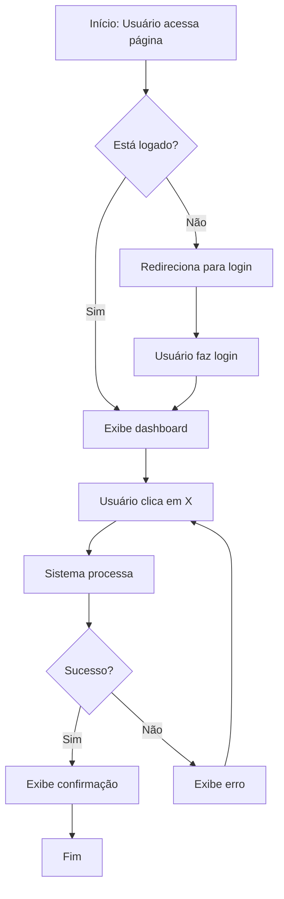
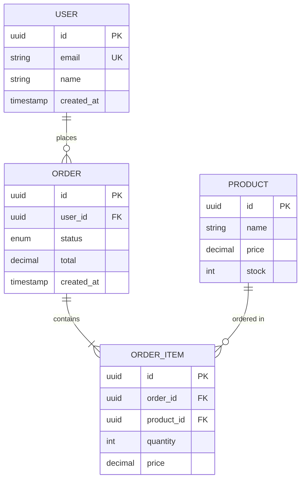
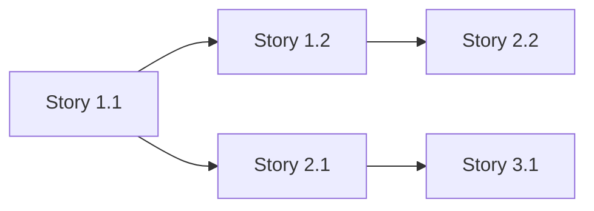

# Workflow: /define

> **Propósito:** Planejamento completo e PRECISO para projetos "do zero". Gera documentação técnica detalhada e acionável.

## Regras Críticas

1. **NÃO ESCREVA CÓDIGO** — Este workflow gera apenas documentação.
2. **SEQUENCIAL** — Cada documento depende dos anteriores.
3. **SOCRATIC GATE OBRIGATÓRIO** — Pergunte ANTES de criar.
4. **PRECISÃO TÉCNICA** — Documentos devem ser específicos, não genéricos.
5. **VALIDAÇÃO CONTÍNUA** — Confirme entendimento antes de cada fase.

---

## Fluxo de Execução

### Fase 0: Discovery Profundo (OBRIGATÓRIO)

> **Objetivo:** Extrair informações suficientes para gerar documentação PRECISA e ACIONÁVEL.

Antes de criar qualquer documento, conduza uma entrevista estruturada:

```markdown
## 🔍 Discovery: Entendendo Seu Projeto

Vou fazer algumas perguntas para garantir que a documentação seja precisa e útil.

### Bloco 1: Problema e Contexto
1. **Qual problema específico este sistema resolve?**
   - Descreva uma situação real onde esse problema acontece

2. **Como esse problema é resolvido hoje (se existir solução atual)?**
   - Quais são as limitações da solução atual?

### Bloco 2: Usuários e Casos de Uso
3. **Quem são os usuários principais?** (Seja específico)
   - Exemplo: "Gerentes de RH em empresas de 50-200 funcionários" vs "usuários"

4. **Descreva 3 cenários de uso típicos:**
   - Cenário 1: [Quem] quer [fazer o quê] para [alcançar qual resultado]
   - Cenário 2: ...
   - Cenário 3: ...

### Bloco 3: Funcionalidades Core
5. **Liste as 5 funcionalidades ESSENCIAIS do MVP (em ordem de prioridade):**
   - Para cada uma, descreva o que o usuário deve conseguir fazer

6. **O que NÃO faz parte do MVP?** (Igualmente importante)
   - Funcionalidades que podem esperar versões futuras

### Bloco 4: Restrições Técnicas
7. **Stack técnica preferida ou obrigatória:**
   - Frontend: (React, Vue, Next.js, etc.)
   - Backend: (Node, Python, etc.)
   - Database: (PostgreSQL, MongoDB, Firebase, etc.)
   - Hosting: (Vercel, AWS, etc.)

8. **Integrações obrigatórias:**
   - APIs externas (pagamento, email, auth, etc.)
   - Sistemas legados

### Bloco 5: Contexto de Negócio
9. **Modelo de monetização (se aplicável):**
   - Free, Freemium, Subscription, One-time, etc.

10. **Métricas de sucesso (como saberemos que funcionou?):**
    - Métricas quantitativas (ex: 100 usuários em 30 dias)
    - Métricas qualitativas (ex: NPS > 8)
```

**⚠️ REGRA:** NÃO prossiga até ter respostas claras para TODAS as perguntas.

Se o usuário for vago, faça follow-up:
```markdown
Preciso de mais detalhes sobre [X]. Você mencionou "[resposta vaga]", mas:
- Quantos [usuários/registros/etc] você espera?
- Com que frequência [ação] acontece?
- Qual é o impacto se [cenário de falha]?
```

---

### Fase 1: Product Brief

**Agente:** `product-manager`
**Output:** `docs/planning/01-product-brief.md`
**Skill obrigatória:** `.agent/skills/plan-writing/SKILL.md`

```markdown
# Product Brief: {Nome do Projeto}

## Metadados
- **Data de criação:** {YYYY-MM-DD}
- **Autor:** AI Product Manager
- **Versão:** 1.0
- **Status:** Draft | Em Revisão | Aprovado

---

## 1. Visão do Produto

### 1.1 Declaração de Visão (Vision Statement)
> Em uma frase: O que é este produto e por que ele existe?

**Template:** "Para [PÚBLICO-ALVO] que [TÊM NECESSIDADE], o [NOME DO PRODUTO] é um [CATEGORIA] que [BENEFÍCIO PRINCIPAL]. Diferente de [ALTERNATIVA], nosso produto [DIFERENCIAL]."

**Exemplo:**
> Para gerentes de RH em PMEs que precisam otimizar processos de recrutamento, o TalentFlow é uma plataforma de gestão de candidatos que reduz o tempo de contratação em 50%. Diferente de planilhas ou sistemas enterprise caros, nosso produto oferece automação inteligente com setup em 5 minutos.

### 1.2 Elevator Pitch (30 segundos)
[Versão expandida da visão para apresentação rápida]

---

## 2. Problema

### 2.1 Declaração do Problema
| Aspecto | Descrição |
|---------|-----------|
| **O problema** | [Descrição específica] |
| **Afeta** | [Quem sofre com isso - seja específico] |
| **O impacto é** | [Consequências mensuráveis] |
| **Hoje é resolvido por** | [Soluções atuais e suas limitações] |

### 2.2 Evidências do Problema
- [Dado/Estatística 1 que comprova o problema]
- [Dado/Estatística 2]
- [Citação/Feedback de usuário potencial]

### 2.3 Consequências de Não Resolver
- Curto prazo: [O que acontece em semanas]
- Médio prazo: [O que acontece em meses]
- Longo prazo: [O que acontece em anos]

---

## 3. Solução

### 3.1 Descrição da Solução
[2-3 parágrafos explicando como o produto resolve o problema]

### 3.2 Proposta de Valor Única (UVP)
> **Por que escolher este produto?**

| Diferencial | Como entregamos | Benefício para usuário |
|-------------|-----------------|----------------------|
| [Diferencial 1] | [Implementação] | [Resultado] |
| [Diferencial 2] | [Implementação] | [Resultado] |
| [Diferencial 3] | [Implementação] | [Resultado] |

### 3.3 Funcionalidades Core do MVP
| # | Funcionalidade | Descrição | Justificativa (Por que MVP?) |
|---|----------------|-----------|------------------------------|
| 1 | [Nome] | [O que faz] | [Por que é essencial] |
| 2 | [Nome] | [O que faz] | [Por que é essencial] |
| 3 | [Nome] | [O que faz] | [Por que é essencial] |
| 4 | [Nome] | [O que faz] | [Por que é essencial] |
| 5 | [Nome] | [O que faz] | [Por que é essencial] |

### 3.4 Fora do Escopo (Explicitamente)
| Funcionalidade | Por que não está no MVP | Versão planejada |
|----------------|-------------------------|------------------|
| [Feature A] | [Motivo] | v1.1 |
| [Feature B] | [Motivo] | v2.0 |

---

## 4. Público-Alvo

### 4.1 Persona Primária
| Atributo | Descrição |
|----------|-----------|
| **Nome fictício** | [Ex: "Carlos, o RH Sobrecarregado"] |
| **Cargo/Papel** | [Função específica] |
| **Empresa/Contexto** | [Tamanho, setor, região] |
| **Objetivos** | [O que quer alcançar] |
| **Frustrações** | [Dores atuais] |
| **Comportamento digital** | [Como usa tecnologia] |
| **Quote característica** | ["Frase que essa pessoa diria"] |

### 4.2 Persona Secundária (se houver)
[Mesmo formato]

### 4.3 Anti-Persona (Quem NÃO é nosso usuário)
[Descreva quem não deve usar o produto e por quê]

---

## 5. Métricas de Sucesso

### 5.1 North Star Metric
> **A única métrica que define sucesso:** [Métrica + meta]

### 5.2 Métricas de Acompanhamento

| Categoria | Métrica | Meta MVP | Como medir |
|-----------|---------|----------|------------|
| **Aquisição** | [Ex: Sign-ups/semana] | [Ex: 50] | [Ferramenta] |
| **Ativação** | [Ex: % que completa onboarding] | [Ex: 60%] | [Ferramenta] |
| **Retenção** | [Ex: % volta em 7 dias] | [Ex: 40%] | [Ferramenta] |
| **Receita** | [Ex: MRR] | [Ex: $1000] | [Ferramenta] |
| **Referência** | [Ex: NPS] | [Ex: > 30] | [Ferramenta] |

### 5.3 Critérios de Sucesso do MVP
O MVP será considerado bem-sucedido se:
- [ ] [Critério 1 - específico e mensurável]
- [ ] [Critério 2]
- [ ] [Critério 3]

---

## 6. Riscos e Mitigações

| Risco | Probabilidade | Impacto | Mitigação |
|-------|---------------|---------|-----------|
| [Risco técnico 1] | Alta/Média/Baixa | Alto/Médio/Baixo | [Plano] |
| [Risco de mercado 1] | Alta/Média/Baixa | Alto/Médio/Baixo | [Plano] |
| [Risco de execução 1] | Alta/Média/Baixa | Alto/Médio/Baixo | [Plano] |

---

## 7. Contexto Técnico (Alto Nível)

### 7.1 Stack Planejada
| Camada | Tecnologia | Justificativa |
|--------|------------|---------------|
| Frontend | [Ex: Next.js 14] | [Por que] |
| Backend | [Ex: Node.js + Express] | [Por que] |
| Database | [Ex: PostgreSQL] | [Por que] |
| Auth | [Ex: Clerk] | [Por que] |
| Hosting | [Ex: Vercel + Supabase] | [Por que] |

### 7.2 Integrações Necessárias
| Integração | Propósito | Prioridade |
|------------|-----------|------------|
| [API 1] | [Para quê] | MVP / Pós-MVP |
| [API 2] | [Para quê] | MVP / Pós-MVP |

---

## Aprovações

| Papel | Nome | Status | Data |
|-------|------|--------|------|
| Product Owner | [Nome/Usuário] | ⏳ Pendente | - |
| Tech Lead | [Nome/Usuário] | ⏳ Pendente | - |
```

**🔍 CHECKPOINT:**
```markdown
📄 Documento gerado: `docs/planning/01-product-brief.md`

Por favor, revise o Product Brief e responda:
- `ok` — Aprovar e continuar para PRD
- `editar [seção]` — Ajustar seção específica (ex: "editar personas")
- `cancelar` — Parar o workflow

**Perguntas de validação:**
1. A visão do produto captura sua ideia corretamente?
2. As personas representam seus usuários reais?
3. As métricas de sucesso são realistas?
```

**AGUARDE** resposta antes de prosseguir.

---

### Fase 2: PRD (Product Requirements Document)

**Agente:** `product-manager`
**Output:** `docs/planning/02-prd.md`
**Referência:** Leia `docs/planning/01-product-brief.md` antes de começar

```markdown
# PRD: {Nome do Projeto}

## Metadados
- **Baseado em:** 01-product-brief.md
- **Data:** {YYYY-MM-DD}
- **Versão:** 1.0

---

## 1. Requisitos Funcionais

### Legenda de Prioridade
- **P0 (Crítico):** Sem isso, o produto não funciona. Bloqueador de lançamento.
- **P1 (Importante):** Essencial para a proposta de valor. Pode lançar sem, mas prejudica.
- **P2 (Desejável):** Melhora a experiência, mas não é essencial para MVP.

---

### RF01: [Nome do Requisito]
| Campo | Valor |
|-------|-------|
| **ID** | RF01 |
| **Título** | [Nome claro e descritivo] |
| **Descrição** | Como [PERSONA], eu quero [AÇÃO] para que [BENEFÍCIO] |
| **Prioridade** | P0 / P1 / P2 |
| **Épico relacionado** | [Nome do Épico] |

**Critérios de Aceite (Gherkin):**
```gherkin
DADO que [contexto/pré-condição]
QUANDO [ação do usuário]
ENTÃO [resultado esperado]
E [resultado adicional se houver]
```

**Casos de Borda:**
- [ ] [Cenário limite 1 e comportamento esperado]
- [ ] [Cenário limite 2 e comportamento esperado]

**Regras de Negócio:**
- RN01: [Regra específica]
- RN02: [Regra específica]

**Dependências:**
- Depende de: [RF## se houver]
- Bloqueia: [RF## se houver]

**Mockup/Wireframe:** (se aplicável)
[Link ou descrição da interface]

---

### RF02: [Nome do Requisito]
[Mesmo formato do RF01]

---

### RF03: [Nome do Requisito]
[Mesmo formato...]

---

## 2. Requisitos Não-Funcionais

### RNF01: Performance
| Aspecto | Requisito | Como medir |
|---------|-----------|------------|
| Tempo de carregamento inicial | < 3 segundos (LCP) | Lighthouse |
| Tempo de resposta de API | < 200ms (p95) | APM |
| Time to Interactive | < 5 segundos | Lighthouse |

### RNF02: Escalabilidade
| Aspecto | Requisito MVP | Requisito v1.0 |
|---------|---------------|----------------|
| Usuários simultâneos | 100 | 1.000 |
| Requisições/minuto | 1.000 | 10.000 |
| Dados armazenados | 10GB | 100GB |

### RNF03: Segurança
| Requisito | Implementação |
|-----------|---------------|
| Autenticação | [JWT / Session / OAuth] |
| Autorização | [RBAC / ABAC] |
| Criptografia em trânsito | TLS 1.3 |
| Criptografia em repouso | AES-256 |
| Conformidade | [LGPD / GDPR / SOC2 se aplicável] |

### RNF04: Disponibilidade
- **Uptime alvo:** 99.5%
- **RPO (Recovery Point Objective):** [Tempo máximo de perda de dados]
- **RTO (Recovery Time Objective):** [Tempo máximo de indisponibilidade]

### RNF05: Acessibilidade
- **Nível WCAG:** AA
- **Leitores de tela:** Compatível
- **Navegação por teclado:** Completa

---

## 3. Fluxos de Usuário (User Journeys)

### Fluxo 1: [Nome do Fluxo Principal]

**Objetivo:** [O que o usuário quer alcançar]
**Persona:** [Qual persona]
**Pré-condições:** [Estado inicial]



**Passos detalhados:**
| # | Ação do Usuário | Resposta do Sistema | Dados envolvidos |
|---|-----------------|---------------------|------------------|
| 1 | [Ação] | [Resposta] | [Entidades] |
| 2 | [Ação] | [Resposta] | [Entidades] |

**Cenários de erro:**
| Código | Condição | Mensagem para usuário | Ação do sistema |
|--------|----------|----------------------|-----------------|
| E001 | [Quando ocorre] | [Mensagem amigável] | [Log, retry, etc] |

---

### Fluxo 2: [Nome do Segundo Fluxo]
[Mesmo formato]

---

## 4. Regras de Negócio Globais

### RN-G01: [Nome da Regra]
- **Descrição:** [O que a regra define]
- **Condição:** SE [condição]
- **Ação:** ENTÃO [resultado]
- **Exceção:** EXCETO QUANDO [exceção]
- **Afeta:** [Quais RFs são impactados]

### RN-G02: [Nome da Regra]
[Mesmo formato]

---

## 5. Integrações

### INT01: [Nome da Integração]
| Campo | Valor |
|-------|-------|
| **Serviço** | [Nome do serviço externo] |
| **Propósito** | [Para que é usado] |
| **Tipo** | REST API / Webhook / SDK / OAuth |
| **Autenticação** | API Key / OAuth2 / JWT |
| **Rate Limits** | [Limites conhecidos] |
| **Fallback** | [O que fazer se falhar] |

**Endpoints utilizados:**
| Método | Endpoint | Propósito |
|--------|----------|-----------|
| GET | `/api/v1/resource` | [Descrição] |
| POST | `/api/v1/resource` | [Descrição] |

**Tratamento de erros:**
| Status Code | Significado | Ação |
|-------------|-------------|------|
| 429 | Rate limit | Retry com backoff |
| 500 | Erro servidor | Log + fallback |

---

## 6. Matriz de Rastreabilidade

| Requisito | Épico | User Story | Critério de Teste |
|-----------|-------|------------|-------------------|
| RF01 | Epic 1 | Story 1.1 | TC001, TC002 |
| RF02 | Epic 1 | Story 1.2 | TC003 |
| RF03 | Epic 2 | Story 2.1 | TC004, TC005 |

---

## Glossário

| Termo | Definição |
|-------|-----------|
| [Termo técnico/negócio 1] | [Definição clara] |
| [Termo técnico/negócio 2] | [Definição clara] |
```

**🔍 CHECKPOINT:**
```markdown
📄 Documento gerado: `docs/planning/02-prd.md`

Por favor, revise o PRD e responda:
- `ok` — Aprovar e continuar para Design System
- `editar [requisito]` — Ajustar requisito específico (ex: "editar RF03")
- `cancelar` — Parar o workflow

**Perguntas de validação:**
1. Os requisitos funcionais cobrem todos os cenários essenciais?
2. Os critérios de aceite são verificáveis?
3. As regras de negócio estão corretas?
```

**AGUARDE** resposta antes de prosseguir.

---

### Fase 3: Design System

**Agente:** `frontend-specialist`
**Output:** `docs/planning/03-design-system.md`
**Referência:** Leia `01-product-brief.md` e `02-prd.md` antes de começar

```markdown
# Design System: {Nome do Projeto}

## Metadados
- **Baseado em:** 01-product-brief.md, 02-prd.md
- **Data:** {YYYY-MM-DD}
- **Framework CSS:** [Tailwind / CSS Modules / Styled Components]

---

## 1. Fundamentos

### 1.1 Princípios de Design
1. **[Princípio 1]:** [Descrição - ex: "Clareza sobre estética"]
2. **[Princípio 2]:** [Descrição]
3. **[Princípio 3]:** [Descrição]

### 1.2 Tom de Voz Visual
- **Personalidade:** [Ex: Profissional mas acessível]
- **Sensação desejada:** [Ex: Confiança, modernidade, simplicidade]

---

## 2. Paleta de Cores

### 2.1 Cores Primárias
| Token | Nome | Hex | RGB | Uso |
|-------|------|-----|-----|-----|
| `--color-primary-50` | Primary Lightest | #EEF2FF | rgb(238,242,255) | Backgrounds sutis |
| `--color-primary-100` | Primary Light | #E0E7FF | rgb(224,231,255) | Hover states |
| `--color-primary-500` | Primary | #6366F1 | rgb(99,102,241) | Botões, links |
| `--color-primary-600` | Primary Dark | #4F46E5 | rgb(79,70,229) | Hover de botões |
| `--color-primary-900` | Primary Darkest | #312E81 | rgb(49,46,129) | Texto em fundo claro |

### 2.2 Cores Secundárias
[Mesmo formato]

### 2.3 Cores Semânticas
| Token | Hex | Uso |
|-------|-----|-----|
| `--color-success` | #10B981 | Confirmações, sucesso |
| `--color-warning` | #F59E0B | Alertas, atenção |
| `--color-error` | #EF4444 | Erros, ações destrutivas |
| `--color-info` | #3B82F6 | Informações, dicas |

### 2.4 Cores Neutras
| Token | Hex | Uso |
|-------|-----|-----|
| `--color-gray-50` | #F9FAFB | Background principal |
| `--color-gray-100` | #F3F4F6 | Background cards |
| `--color-gray-200` | #E5E7EB | Bordas |
| `--color-gray-400` | #9CA3AF | Texto placeholder |
| `--color-gray-600` | #4B5563 | Texto secundário |
| `--color-gray-900` | #111827 | Texto principal |

### 2.5 Modo Escuro (se aplicável)
| Token Light | Token Dark | Mapeamento |
|-------------|------------|------------|
| `--color-gray-50` | `--color-gray-900` | Background |
| `--color-gray-900` | `--color-gray-50` | Texto |

---

## 3. Tipografia

### 3.1 Famílias Tipográficas
| Propósito | Fonte | Fallback | CDN/Import |
|-----------|-------|----------|------------|
| Headlines | Inter | system-ui, sans-serif | Google Fonts |
| Body | Inter | system-ui, sans-serif | Google Fonts |
| Code | JetBrains Mono | monospace | Google Fonts |

### 3.2 Escala Tipográfica
| Token | Tamanho | Line Height | Letter Spacing | Uso |
|-------|---------|-------------|----------------|-----|
| `--text-xs` | 12px / 0.75rem | 1.5 | 0.01em | Labels, captions |
| `--text-sm` | 14px / 0.875rem | 1.5 | 0 | Body small |
| `--text-base` | 16px / 1rem | 1.5 | 0 | Body default |
| `--text-lg` | 18px / 1.125rem | 1.5 | -0.01em | Body large |
| `--text-xl` | 20px / 1.25rem | 1.4 | -0.01em | H4 |
| `--text-2xl` | 24px / 1.5rem | 1.3 | -0.02em | H3 |
| `--text-3xl` | 30px / 1.875rem | 1.2 | -0.02em | H2 |
| `--text-4xl` | 36px / 2.25rem | 1.1 | -0.02em | H1 |

### 3.3 Pesos
| Token | Weight | Uso |
|-------|--------|-----|
| `--font-normal` | 400 | Texto corrido |
| `--font-medium` | 500 | Labels, botões |
| `--font-semibold` | 600 | Subtítulos |
| `--font-bold` | 700 | Headlines |

---

## 4. Espaçamento

### 4.1 Escala Base (8px)
| Token | Valor | Equivalente |
|-------|-------|-------------|
| `--space-0` | 0 | 0 |
| `--space-1` | 4px | 0.25rem |
| `--space-2` | 8px | 0.5rem |
| `--space-3` | 12px | 0.75rem |
| `--space-4` | 16px | 1rem |
| `--space-5` | 20px | 1.25rem |
| `--space-6` | 24px | 1.5rem |
| `--space-8` | 32px | 2rem |
| `--space-10` | 40px | 2.5rem |
| `--space-12` | 48px | 3rem |
| `--space-16` | 64px | 4rem |

### 4.2 Aplicação
| Contexto | Espaçamento | Exemplo |
|----------|-------------|---------|
| Entre ícone e texto | `--space-2` | Botão com ícone |
| Padding interno de cards | `--space-4` a `--space-6` | Card padrão |
| Entre seções | `--space-8` a `--space-12` | Blocos de conteúdo |
| Margens de página | `--space-4` (mobile) / `--space-8` (desktop) | Container |

---

## 5. Layout

### 5.1 Breakpoints
| Nome | Min-width | Uso típico |
|------|-----------|------------|
| `sm` | 640px | Tablets portrait |
| `md` | 768px | Tablets landscape |
| `lg` | 1024px | Desktop pequeno |
| `xl` | 1280px | Desktop padrão |
| `2xl` | 1536px | Desktop grande |

### 5.2 Container
| Breakpoint | Max-width | Padding |
|------------|-----------|---------|
| Default | 100% | 16px |
| `sm` | 640px | 16px |
| `md` | 768px | 24px |
| `lg` | 1024px | 32px |
| `xl` | 1280px | 32px |

### 5.3 Grid System
- **Colunas:** 12
- **Gutter:** 24px (desktop) / 16px (mobile)
- **Uso:** CSS Grid ou Flexbox

---

## 6. Componentes Base

### 6.1 Buttons

#### Variantes
| Variante | Classe | Uso |
|----------|--------|-----|
| Primary | `.btn-primary` | Ação principal (1 por tela) |
| Secondary | `.btn-secondary` | Ações secundárias |
| Outline | `.btn-outline` | Ações terciárias |
| Ghost | `.btn-ghost` | Ações sutis |
| Destructive | `.btn-destructive` | Ações perigosas |

#### Tamanhos
| Tamanho | Classe | Height | Padding | Font Size |
|---------|--------|--------|---------|-----------|
| Small | `.btn-sm` | 32px | 12px 16px | 14px |
| Default | `.btn` | 40px | 12px 20px | 16px |
| Large | `.btn-lg` | 48px | 16px 24px | 18px |

#### Estados
| Estado | Descrição |
|--------|-----------|
| Default | Estado padrão |
| Hover | Cor levemente mais escura |
| Active/Pressed | Cor ainda mais escura |
| Focus | Ring de 2px offset |
| Disabled | Opacity 50%, cursor not-allowed |
| Loading | Spinner substituindo texto |

#### Especificação Técnica
```css
.btn-primary {
  background: var(--color-primary-500);
  color: white;
  font-weight: 500;
  border-radius: 8px;
  transition: all 150ms ease;
}
.btn-primary:hover {
  background: var(--color-primary-600);
}
.btn-primary:focus {
  outline: none;
  ring: 2px solid var(--color-primary-500);
  ring-offset: 2px;
}
```

---

### 6.2 Inputs

#### Tipos
- Text Input
- Textarea
- Select
- Checkbox
- Radio
- Toggle/Switch

#### Anatomia do Input
```
[Label]
[Input Field] [Ícone opcional]
[Helper text / Error message]
```

#### Estados
| Estado | Border Color | Background | Descrição |
|--------|--------------|------------|-----------|
| Default | `--color-gray-200` | white | Estado inicial |
| Hover | `--color-gray-300` | white | Mouse over |
| Focus | `--color-primary-500` | white | Digitando |
| Error | `--color-error` | white | Validação falhou |
| Disabled | `--color-gray-200` | `--color-gray-100` | Não editável |

#### Especificação Técnica
```css
.input {
  height: 40px;
  padding: 8px 12px;
  border: 1px solid var(--color-gray-200);
  border-radius: 6px;
  font-size: 16px;
}
.input:focus {
  border-color: var(--color-primary-500);
  box-shadow: 0 0 0 3px rgba(99, 102, 241, 0.1);
}
.input-error {
  border-color: var(--color-error);
}
```

---

### 6.3 Cards

#### Variantes
| Variante | Uso |
|----------|-----|
| Default | Container de conteúdo |
| Interactive | Card clicável |
| Elevated | Card com sombra mais forte |

#### Especificação
```css
.card {
  background: white;
  border: 1px solid var(--color-gray-200);
  border-radius: 12px;
  padding: 24px;
  box-shadow: 0 1px 3px rgba(0,0,0,0.1);
}
.card-interactive:hover {
  border-color: var(--color-primary-200);
  box-shadow: 0 4px 6px rgba(0,0,0,0.1);
}
```

---

### 6.4 Modals/Dialogs

#### Tamanhos
| Tamanho | Max-width | Uso |
|---------|-----------|-----|
| Small | 400px | Confirmações |
| Default | 500px | Formulários simples |
| Large | 700px | Formulários complexos |
| Full | 90vw | Conteúdo extenso |

#### Anatomia
```
[Overlay escuro 50%]
  [Modal Container]
    [Header: Título + Botão fechar]
    [Body: Conteúdo]
    [Footer: Ações]
```

---

### 6.5 Outros Componentes

| Componente | Descrição |
|------------|-----------|
| Avatar | Imagem de perfil circular |
| Badge | Labels pequenas (status, contadores) |
| Alert/Toast | Notificações |
| Tabs | Navegação em abas |
| Breadcrumb | Navegação hierárquica |
| Pagination | Navegação de páginas |
| Table | Dados tabulares |
| Dropdown | Menus suspensos |
| Tooltip | Dicas contextuais |
| Progress | Indicadores de progresso |
| Skeleton | Loading states |

---

## 7. Iconografia

### 7.1 Biblioteca
- **Biblioteca principal:** [Heroicons / Lucide / Phosphor]
- **Tamanhos:** 16px, 20px, 24px
- **Estilo:** Outline (padrão) / Solid (ênfase)

### 7.2 Ícones Essenciais
| Ação | Ícone | Nome |
|------|-------|------|
| Menu | ☰ | `menu` |
| Fechar | ✕ | `x` |
| Buscar | 🔍 | `search` |
| Usuário | 👤 | `user` |
| Configurações | ⚙️ | `settings` |
| Sair | 🚪 | `logout` |

---

## 8. Animações e Transições

### 8.1 Durations
| Nome | Valor | Uso |
|------|-------|-----|
| Fast | 100ms | Hovers, feedbacks imediatos |
| Default | 200ms | Transições comuns |
| Slow | 300ms | Modais, expansões |

### 8.2 Easings
| Nome | Valor | Uso |
|------|-------|-----|
| Default | `ease` | Geral |
| In | `ease-in` | Saídas |
| Out | `ease-out` | Entradas |
| InOut | `ease-in-out` | Completas |

---

## 9. Acessibilidade

### 9.1 Checklist por Componente
- [ ] Contraste mínimo 4.5:1 para texto
- [ ] Contraste mínimo 3:1 para elementos gráficos
- [ ] Focus states visíveis
- [ ] Labels associados a inputs
- [ ] ARIA labels quando necessário
- [ ] Navegação por teclado funcional

### 9.2 Textos Alternativos
[Guia para alt text em imagens]
```

**🔍 CHECKPOINT:**
```markdown
📄 Documento gerado: `docs/planning/03-design-system.md`

Por favor, revise o Design System e responda:
- `ok` — Aprovar e continuar para Database
- `editar [seção]` — Ajustar seção específica (ex: "editar cores")
- `cancelar` — Parar o workflow

**Perguntas de validação:**
1. As cores refletem a identidade desejada?
2. A escala tipográfica está adequada?
3. Os componentes cobrem as necessidades do PRD?
```

**AGUARDE** resposta antes de prosseguir.

---

### Fase 4: Database Layout

**Agente:** `database-architect`
**Output:** `docs/planning/04-database.md`
**Referência:** Leia todos os documentos anteriores

```markdown
# Database Design: {Nome do Projeto}

## Metadados
- **Baseado em:** PRD e requisitos funcionais
- **Tipo de banco:** [SQL / NoSQL / Hybrid]
- **Tecnologia:** [PostgreSQL / MongoDB / Firebase / etc]
- **ORM:** [Prisma / Drizzle / Mongoose / etc]

---

## 1. Diagrama de Entidade-Relacionamento



---

## 2. Schemas Detalhados

### 2.1 Tabela: `users`

**Descrição:** Armazena informações de usuários registrados.

| Coluna | Tipo | Constraints | Default | Descrição |
|--------|------|-------------|---------|-----------|
| `id` | UUID | PK | `gen_random_uuid()` | Identificador único |
| `email` | VARCHAR(255) | UNIQUE, NOT NULL | - | Email do usuário |
| `password_hash` | VARCHAR(255) | NOT NULL | - | Hash bcrypt da senha |
| `name` | VARCHAR(100) | NOT NULL | - | Nome completo |
| `avatar_url` | VARCHAR(500) | NULLABLE | NULL | URL da foto |
| `role` | ENUM('user', 'admin') | NOT NULL | 'user' | Papel no sistema |
| `email_verified` | BOOLEAN | NOT NULL | false | Email confirmado? |
| `created_at` | TIMESTAMP | NOT NULL | `now()` | Data de criação |
| `updated_at` | TIMESTAMP | NOT NULL | `now()` | Data de atualização |
| `deleted_at` | TIMESTAMP | NULLABLE | NULL | Soft delete |

**Índices:**
| Nome | Colunas | Tipo | Propósito |
|------|---------|------|-----------|
| `users_pkey` | `id` | PRIMARY | Chave primária |
| `users_email_key` | `email` | UNIQUE | Busca por email |
| `users_role_idx` | `role` | BTREE | Filtro por papel |

**Triggers:**
- `update_updated_at`: Atualiza `updated_at` em qualquer UPDATE

**Schema Prisma:**
```prisma
model User {
  id            String    @id @default(uuid())
  email         String    @unique
  passwordHash  String    @map("password_hash")
  name          String
  avatarUrl     String?   @map("avatar_url")
  role          Role      @default(USER)
  emailVerified Boolean   @default(false) @map("email_verified")
  createdAt     DateTime  @default(now()) @map("created_at")
  updatedAt     DateTime  @updatedAt @map("updated_at")
  deletedAt     DateTime? @map("deleted_at")

  orders        Order[]

  @@map("users")
}

enum Role {
  USER
  ADMIN
}
```

---

### 2.2 Tabela: `[próxima tabela]`

[Mesmo formato detalhado para cada entidade]

---

## 3. Relacionamentos

### 3.1 Mapeamento de Relações

| Origem | Destino | Tipo | FK | Descrição |
|--------|---------|------|-----|-----------|
| `users` | `orders` | 1:N | `orders.user_id` | Usuário faz pedidos |
| `orders` | `order_items` | 1:N | `order_items.order_id` | Pedido tem itens |
| `products` | `order_items` | 1:N | `order_items.product_id` | Produto em pedidos |

### 3.2 Regras de Integridade Referencial

| FK | On Delete | On Update | Justificativa |
|----|-----------|-----------|---------------|
| `orders.user_id` | RESTRICT | CASCADE | Não deletar user com pedidos |
| `order_items.order_id` | CASCADE | CASCADE | Deletar itens junto com pedido |
| `order_items.product_id` | RESTRICT | CASCADE | Não deletar produto em pedidos |

---

## 4. Índices e Performance

### 4.1 Índices Compostos

| Tabela | Nome | Colunas | Tipo | Justificativa |
|--------|------|---------|------|---------------|
| `orders` | `idx_user_status` | `(user_id, status)` | BTREE | Listar pedidos por usuário e status |
| `order_items` | `idx_order_product` | `(order_id, product_id)` | BTREE | Buscar item específico |

### 4.2 Índices de Texto (se aplicável)

| Tabela | Coluna | Tipo | Configuração |
|--------|--------|------|--------------|
| `products` | `name` | GIN | `to_tsvector('portuguese', name)` |

### 4.3 Queries Críticas e Seus Planos

**Query 1:** Listar pedidos recentes de um usuário
```sql
SELECT * FROM orders
WHERE user_id = $1 AND status = 'completed'
ORDER BY created_at DESC
LIMIT 10;
-- Usa: idx_user_status
-- Estimativa: < 5ms
```

**Query 2:** [Próxima query importante]

---

## 5. Segurança e Acesso

### 5.1 Row-Level Security (PostgreSQL)

```sql
-- Habilitar RLS
ALTER TABLE orders ENABLE ROW LEVEL SECURITY;

-- Policy: Usuário só vê próprios pedidos
CREATE POLICY user_orders_policy ON orders
  FOR ALL
  USING (user_id = current_user_id());
```

### 5.2 Firestore Security Rules (se aplicável)

```javascript
rules_version = '2';
service cloud.firestore {
  match /databases/{database}/documents {
    match /users/{userId} {
      allow read, write: if request.auth != null && request.auth.uid == userId;
    }
    match /orders/{orderId} {
      allow read: if request.auth != null &&
                    resource.data.userId == request.auth.uid;
      allow create: if request.auth != null;
    }
  }
}
```

### 5.3 Dados Sensíveis

| Campo | Sensibilidade | Proteção |
|-------|---------------|----------|
| `users.password_hash` | Alta | Nunca expor via API |
| `users.email` | Média | Mascarar em logs |
| `orders.total` | Baixa | Visível apenas ao dono |

---

## 6. Migrations

### 6.1 Migration Inicial

```sql
-- 001_create_users.sql
CREATE TABLE users (
  id UUID PRIMARY KEY DEFAULT gen_random_uuid(),
  email VARCHAR(255) UNIQUE NOT NULL,
  password_hash VARCHAR(255) NOT NULL,
  name VARCHAR(100) NOT NULL,
  role VARCHAR(20) NOT NULL DEFAULT 'user',
  created_at TIMESTAMP NOT NULL DEFAULT now(),
  updated_at TIMESTAMP NOT NULL DEFAULT now()
);

CREATE INDEX users_email_idx ON users(email);
```

### 6.2 Ordem de Execução

1. `001_create_users.sql`
2. `002_create_products.sql`
3. `003_create_orders.sql`
4. `004_create_order_items.sql`
5. `005_add_indexes.sql`

---

## 7. Seeds (Dados Iniciais)

```sql
-- seeds/01_admin_user.sql
INSERT INTO users (email, password_hash, name, role) VALUES
('admin@example.com', '$2b$10$...', 'Admin', 'admin');

-- seeds/02_sample_products.sql
INSERT INTO products (name, price, stock) VALUES
('Produto 1', 99.90, 100),
('Produto 2', 149.90, 50);
```

---

## 8. Backup e Recovery

### 8.1 Estratégia de Backup
| Tipo | Frequência | Retenção | Destino |
|------|------------|----------|---------|
| Full | Diário | 30 dias | S3/GCS |
| Incremental | A cada hora | 7 dias | S3/GCS |
| Point-in-time | Contínuo | 7 dias | WAL archiving |

### 8.2 Procedimento de Restore
[Documentar passos de recovery]

---

## 9. Checklist de Validação

- [ ] Todas as FKs têm índice na coluna de origem
- [ ] Soft delete implementado onde necessário
- [ ] Timestamps de auditoria em todas as tabelas
- [ ] Enums definidos para campos com valores fixos
- [ ] RLS/Security Rules definidas
- [ ] Migrations reversíveis
- [ ] Seeds para desenvolvimento
```

**🔍 CHECKPOINT:**
```markdown
📄 Documento gerado: `docs/planning/04-database.md`

Por favor, revise o Database Design e responda:
- `ok` — Aprovar e criar Backlog Final
- `editar [seção]` — Ajustar seção específica (ex: "editar tabela users")
- `cancelar` — Parar o workflow

**Perguntas de validação:**
1. As entidades cobrem todos os requisitos funcionais?
2. Os relacionamentos estão corretos?
3. Os índices são suficientes para as queries esperadas?
```

**AGUARDE** resposta antes de prosseguir.

---

### Fase 5: Backlog Generation

**Agente:** `project-planner`
**Output:** `docs/BACKLOG.md`
**Referência:** Leia TODOS os 4 documentos anteriores

```markdown
# Backlog do Projeto: {Nome do Projeto}

> **Gerado automaticamente** a partir dos documentos de planejamento.

**Última Atualização:** {YYYY-MM-DD HH:MM}
**Total de Tarefas:** {N}
**Progresso Geral:** 0%

---

## Índice de Épicos

| # | Épico | Stories | Status |
|---|-------|---------|--------|
| 1 | [Nome] | {N} | 🔴 TODO |
| 2 | [Nome] | {N} | 🔴 TODO |
| 3 | [Nome] | {N} | 🔴 TODO |

---

## Epic 1: {Nome do Épico}

> **Objetivo:** {Descrição do objetivo do épico}
> **Requisitos relacionados:** RF01, RF02

### Story 1.1: {Título da Story}

**Como** {persona}, **quero** {ação} **para** {benefício}.

**Critérios de Aceite:**
- [ ] {Critério 1 - verificável}
- [ ] {Critério 2 - verificável}

**Subtarefas:**
- [ ] **1.1.1:** {Subtarefa técnica específica}
- [ ] **1.1.2:** {Subtarefa técnica específica}
- [ ] **1.1.3:** {Subtarefa técnica específica}

**Dependências:** Nenhuma | Story X.Y
**Estimativa:** [P/M/G] (Pequena/Média/Grande)

---

### Story 1.2: {Título da Story}

[Mesmo formato]

---

## Epic 2: {Nome do Épico}

[Mesmo formato]

---

## Epic 3: {Nome do Épico}

[Mesmo formato]

---

## Resumo de Progresso

### Por Épico

| Épico | Total | Concluídas | Em Progresso | TODO | % |
|-------|-------|------------|--------------|------|---|
| Epic 1: {Nome} | {N} | 0 | 0 | {N} | 0% |
| Epic 2: {Nome} | {N} | 0 | 0 | {N} | 0% |
| Epic 3: {Nome} | {N} | 0 | 0 | {N} | 0% |
| **TOTAL** | **{N}** | **0** | **0** | **{N}** | **0%** |

### Barra de Progresso

```
[░░░░░░░░░░░░░░░░░░░░] 0% (0/{N} stories)
```

---

## Dependências Entre Stories



---

## Ordem de Execução Sugerida

1. **Fase Foundations:** Story 1.1, 1.2 (Setup inicial)
2. **Fase Core:** Story 2.1, 2.2, 2.3 (Funcionalidades principais)
3. **Fase Polish:** Story 3.1, 3.2 (Refinamentos)
4. **Fase Launch:** Story 4.1 (Deploy e go-live)

---

## Notas de Planejamento

- **Risco principal:** {Identificar maior risco técnico ou de negócio}
- **Decisões pendentes:** {Listar decisões que precisam ser tomadas}
- **Considerações técnicas:** {Observações relevantes}

---

## Changelog

| Data | Alteração | Autor |
|------|-----------|-------|
| {YYYY-MM-DD} | Backlog inicial criado | AI Project Planner |
```

---

## Pós-Execução

Após criar todos os 5 documentos:

```markdown
## ✅ Workflow /define Concluído!

### Documentos Gerados:
1. 📄 `docs/planning/01-product-brief.md` — Visão e contexto do produto
2. 📄 `docs/planning/02-prd.md` — Requisitos funcionais e não-funcionais
3. 📄 `docs/planning/03-design-system.md` — Sistema de design completo
4. 📄 `docs/planning/04-database.md` — Arquitetura de dados
5. 📋 `docs/BACKLOG.md` — Backlog priorizado com {N} stories

### Próximos Passos Sugeridos:
1. **Revisar documentos** com stakeholders
2. **Rodar `/track`** para inicializar tracking de progresso
3. **Iniciar implementação** com `implementar Story 1.1`

### Comandos Úteis:
- `/status` — Ver dashboard do projeto
- `/track` — Atualizar progresso
- `implementar Epic 1` — Começar implementação

⚠️ **NÃO inicio implementação sem sua aprovação explícita.**
```

---

## Regras de Qualidade

### Documentação Precisa Deve:

1. **Ser Específica:** Evite termos vagos como "vários", "alguns", "etc"
2. **Ser Mensurável:** Inclua números, métricas, limites
3. **Ser Acionável:** Cada item deve poder ser executado ou verificado
4. **Ser Consistente:** Use os mesmos termos ao longo dos documentos
5. **Ser Rastreável:** Relacione requisitos → stories → tarefas

### Anti-Padrões a Evitar:

❌ "Sistema deve ser rápido" → ✅ "API responde em < 200ms (p95)"
❌ "Usuários podem fazer coisas" → ✅ "Usuário pode criar até 10 projetos"
❌ "Implementar login" → ✅ "RF01: Autenticação via email/senha com rate limiting"
❌ Copiar templates genéricos → ✅ Adaptar ao contexto específico do projeto
